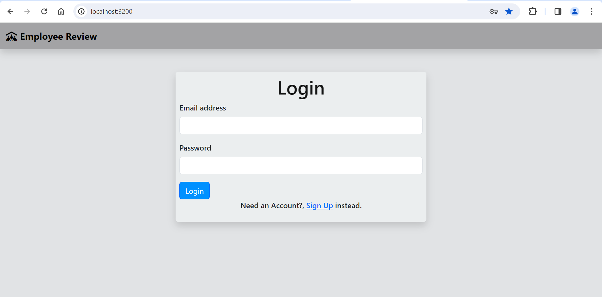
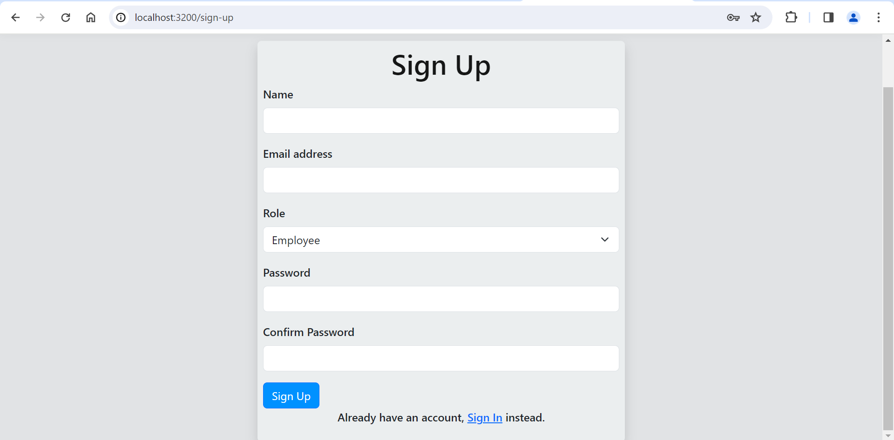
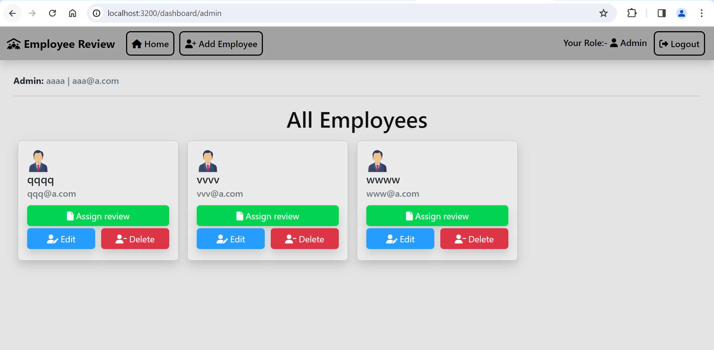
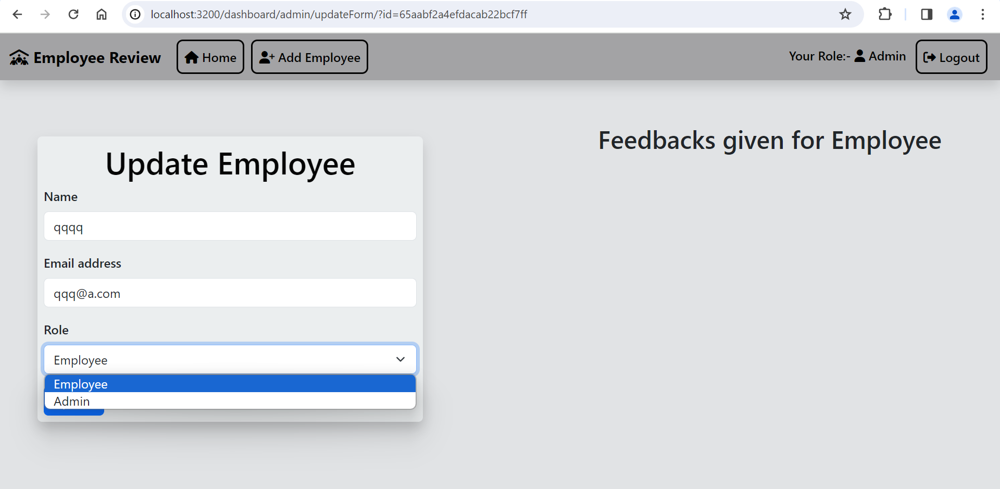
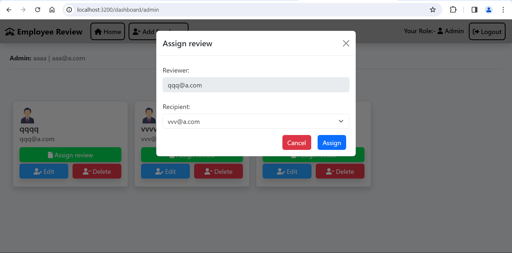
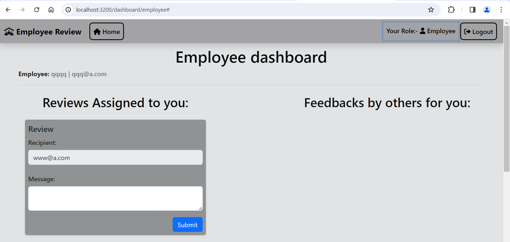
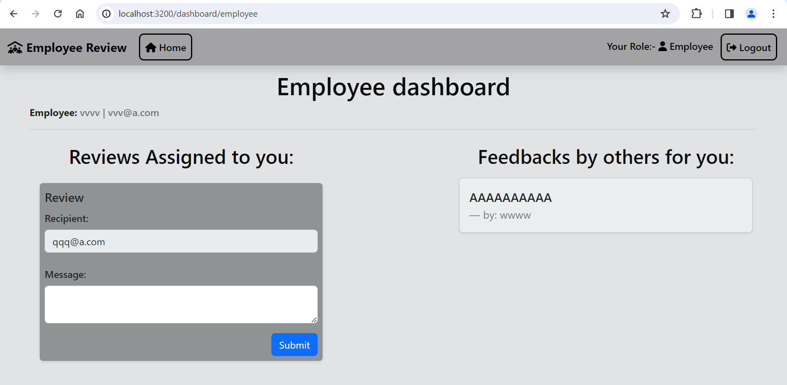

# Employee_Reviews_System_App
This Employee review system web application allows employees to submit the feedback toward each other’s performance.
It is built using NodeJs, ExpressJs, MongoDB, EJS and JavaScript.

## ⚙️ Functionality
- User-Admin/Employee singUp and signIn
- Add Employee
- Edit Employee
- Delete Employee
- Allocate added employee to add feedback for others
- Add comments/feedback for other employee

## 🧑‍💻 Getting started
- Fork the project from git repository- https://github.com/sanketg99/Employee_Review_System_App
- Clone the forked repository in your local system
- Create .env file in the root directory and add the following:-
  - PORT = "Your port number"
  - MONGODB_URL = "Your MongoDB URL"
  - SESSION_SECRET_KEY = "Your secret session key"
- Install all required packages
- Run project
   ` npm install ` 
- The project is running on the port number provided by you.
   ` npm start `

## 🛠️ Tools Used
- NodeJS
- MongoDB
- EJS

### 📚 Libraries:
- bcrypt
- cryptjs
- body-parser
- connect-flash
- cookie-parser
- dotenv
- ejs
- express
- express-ejs-layouts
- express-session
- mongodb
- mongoose
- nodemon
- passport
- passport-local

## 🖼️ Screenshorts

